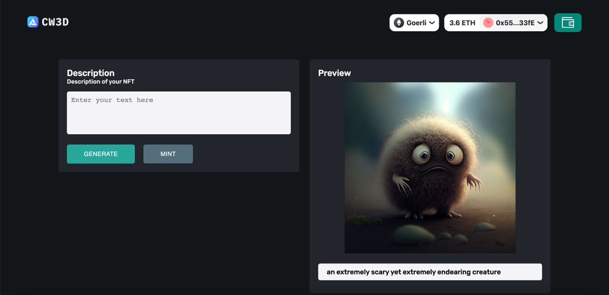

### Preview



# Installation

### Clone the repository and install the dependencies.

```bash
git clone https://github.com/abdibrokhim/hacked-dApp
```

## Go to the project directory

```bash
cd alNFT
```

## FRONTEND

```
cd frontend
```

## Install dependencies

```bash
npm install
```

## Start the server

```bash
npm run dev
```

it will start the server on port 3000

---

## BACKEND

```
cd backend
```

## Install dependencies

```bash
npm install
```

## Start the server

```bash
node api/api.js
```

it will start the server on port 3005

<br/>
